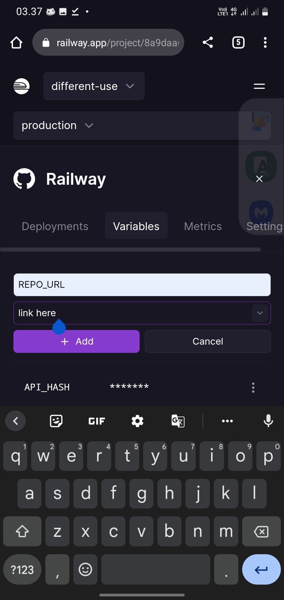

# Railway-App
* An Script to host on railway.app

# Support
* [x] Ultroid Userbot
* [x] pyroman-userbot
* [x] darkweb-userbot
* [x] yukki support
* [x] all

# Tutorial Variables
</img>

# Add In Env
```
REPO_URL = https://github.com/TeamUltroid/Ultroid
AUTO_PIP_INSTALL = pip3 install --no-cache-dir -r requirements.txt && pip3 install --no-cache-dir -r re*/st*/op*.txt
START_CMD = bash startup

```
<b>see read this  :</b> [RendyProjects](https://t.me/RendyProjects/1118)

# License


<h4 align="center">Copyright (C) 2020 - 2023 <a href="https://github.com/TeamKillerX">TeamKillerX</a></h4>

Project [TeamKillerX](https://github.com/TeamKillerX/) is free software: you can redistribute it and/or modify
it under the terms of the GNU General Public License as published by
the Free Software Foundation, either version 3 of the License, or
(at your option) any later version.
This program is distributed in the hope that it will be useful,
but WITHOUT ANY WARRANTY; without even the implied warranty of
MERCHANTABILITY or FITNESS FOR A PARTICULAR PURPOSE.  See the
GNU General Public License for more details.
You should have received a copy of the GNU General Public License
along with this program. If not, see <https://www.gnu.org/licenses/>.
